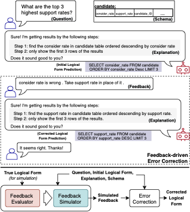

# Learning to Simulate Natural Language Feedback for Interactive Semantic Parsing
This repository provides code implementation for our paper [Learning to Simulate Natural Language Feedback for Interactive Semantic Parsing](https://github.com/hyan5/Learning_to_Simulate_NL_Feedback.git) accepted by *ACL 2023*.

## 1. Overview
<p align="center">

</p>
Interactive semantic parsing based on natural language (NL) feedback, where users provide feedback to correct the parser mistakes, has emerged as a more practical scenario than the traditional one-shot semantic parsing. However, prior work has heavily relied on human-annotated feedback data to train the interactive semantic parser, which is prohibitively expensive and not scalable. In this work, we propose a new task of simulating NL feedback for interactive semantic parsing. We accompany the task with a novel feedback evaluator. The evaluator is specifically designed to assess the quality of the simulated feedback, based on which we decide the best feedback simulator from our proposed variants. On a text-to-SQL dataset, we show that our feedback simulator can generate high-quality NL feedback to boost the error correction ability of a specific parser. In low-data settings, our feedback simulator can help achieve comparable error correction performance as trained using the costly, full set of human annotations.

## 2. Setup
This project is tested in python 3.8.6.

First, clone the repository and set up the `${ISP_HOME}` environment:
```
git clone git@github.com:hyan5/Learning_to_Simulate_NL_Feedback.git
export ISP_HOME=$(pwd)
export PYTHONPATH=$ISP_HOME:$ISP_HOME/utils:$PYTHONPATH
```

Then download the Spider data from [its official website](https://yale-lily.github.io/spider) and save it under the `data/spider/` folder. The data paths have been added to the global config file `config.py`.

Create a virtual environment and install all dependencies:
```
python -m venv ispenv 
source ispenv/bin/activate
pip install -r requirements.txt
```

## 2.1 Preparing SPLASH 
The first part of the project will prepare the SPLASH training/dev/test data, including removing structural errors and generating the template-based feedback for each instance. The generation of template-based explanation is skipped since the explanation has been provided by the original SPLASH datasets.

First, download the SPLASH data from [its official repository](https://github.com/MSR-LIT/Splash), and save them under `data/splash/`:
```
mkdir -p data/splash/
cd data/splash
wget https://raw.githubusercontent.com/MSR-LIT/Splash/master/data/train.json
wget https://raw.githubusercontent.com/MSR-LIT/Splash/master/data/dev.json
wget https://raw.githubusercontent.com/MSR-LIT/Splash/master/data/test.json
```

Then, run the following commands to process the SPLASH training data:
```
cd utils
python generate_template_feedback.py -i ../data/splash/train.json -o ../data/splash/train_w_template_feedback.json --no_underscore --no_quote --connect_foreign_key_group
python generate_template_feedback.py -i ../data/splash/dev.json -o ../data/splash/dev_w_template_feedback.json --no_underscore --no_quote --connect_foreign_key_group
python generate_template_feedback.py -i ../data/splash/test.json -o ../data/splash/test_w_template_feedback.json --no_underscore --no_quote --connect_foreign_key_group
```
For details about options of `generate_template_feedback.py`, please refer to [the utility function README](utils/).

Now, you should have three files -- `train_w_template_feedback.json`, `dev_w_template_feedback.json`, and `test_w_template_feedback.json` -- under the `data/splash/` folder, all with template-based feedback. We will use these datasets to train a user feedback simulator.